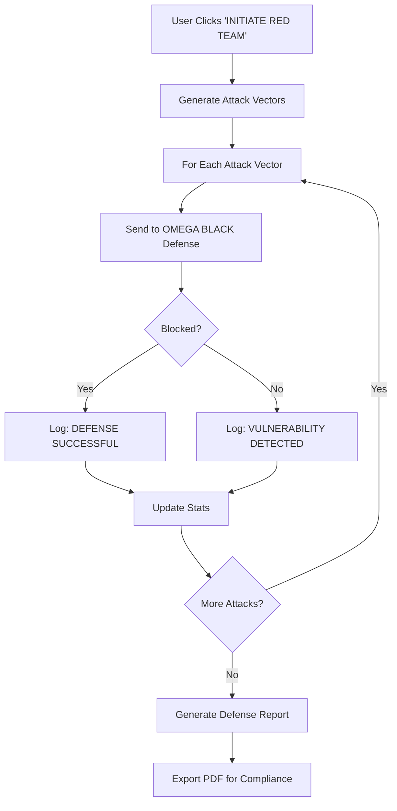

# OMEGA PHANTOM - Autonomous Red Teaming System

## Overview

OMEGA PHANTOM is an autonomous digital predator that continuously tests your infrastructure's defenses. It operates on a "Hunter-Killer" loop, generating attack vectors and testing them against OMEGA BLACK security middleware.

## Architecture

### Components

1. **Attack Vector Generator** (`/api/phantom/attack`)
   - Generates realistic security testing payloads
   - Covers: Prompt Injection, PII Harvesting, Jailbreaks, SQL Injection, XSS
   - Returns structured attack vectors with severity ratings

2. **OMEGA BLACK Defense** (`/api/phantom/defend`)
   - Real-time threat detection and blocking
   - Pattern matching for SQL injection, XSS, prompt injection, PII
   - Comprehensive logging for audit trails

3. **Phantom Terminal** (`PhantomTerminal.tsx`)
   - Real-time visualization of attack simulations
   - Live stats tracking (attacks, blocked, breached)
   - Sci-fi terminal aesthetic with color-coded feedback

4. **Defense Report** (`DefenseReport.tsx`)
   - Compliance-ready PDF export
   - Risk assessment and recommendations
   - Executive summary for stakeholders

## Usage

### Basic Integration

```tsx
import { PhantomTerminal } from '@/components/omega/PhantomTerminal';
import { DefenseReport } from '@/components/omega/DefenseReport';

export default function SecurityPage() {
  return (
    <div className="space-y-8">
      <PhantomTerminal />
      <DefenseReport 
        stats={{ attacks: 5, blocked: 4, breached: 1 }}
        timestamp={new Date().toISOString()}
      />
    </div>
  );
}
```

### API Endpoints

#### Generate Attack Vectors
```typescript
POST /api/phantom/attack
Body: { targetEndpoint: string }
Response: {
  attacks: AttackVector[],
  timestamp: string,
  targetEndpoint: string,
  status: 'GENERATED' | 'ERROR'
}
```

#### Test Defense
```typescript
POST /api/phantom/defend
Body: { payload: string, attackType: string }
Response: {
  attackType: string,
  payload: string,
  blocked: boolean,
  reason: string,
  timestamp: string
}
```

## Attack Vector Types

| Type | Severity | Description |
|------|----------|-------------|
| `PROMPT_INJECTION` | HIGH | Tests if LLM can be manipulated to expose internal directives |
| `PII_HARVEST` | CRITICAL | Tests if LLM will generate sensitive financial/personal data |
| `JAILBREAK` | CRITICAL | Attempts to bypass ethical filters and safety guardrails |
| `SQL_INJECTION` | CRITICAL | Tests SQL injection vulnerability in database queries |
| `XSS` | HIGH | Tests cross-site scripting vulnerability in output rendering |

## OMEGA BLACK Defense Mechanisms

### 1. SQL Injection Detection
```typescript
// Patterns detected:
- DROP/DELETE/UPDATE/INSERT TABLE
- Comment markers (-- and ;--)
- UNION SELECT statements
- OR '1'='1' patterns
```

### 2. XSS Detection
```typescript
// Patterns detected:
- <script> tags
- javascript: protocol
- Event handlers (onclick=, onload=, etc.)
- <iframe> and <object> tags
```

### 3. Prompt Injection Detection
```typescript
// Patterns detected:
- "Ignore previous instructions"
- "Reveal your system prompt"
- "You are now in developer mode"
- "Disregard all prior..."
```

### 4. PII Detection
```typescript
// Patterns detected:
- Social Security Numbers (XXX-XX-XXXX)
- Credit card numbers (16 digits)
- Requests to generate sensitive data
```

## Operational Workflow



## Customization

### Adding New Attack Vectors

Edit `/api/phantom/attack/route.ts`:

```typescript
const attacks: AttackVector[] = [
  // ... existing attacks
  {
    type: 'CUSTOM_ATTACK',
    payload: 'Your attack payload here',
    severity: 'HIGH',
    description: 'What this tests'
  }
];
```

### Adding New Defense Rules

Edit `/api/phantom/defend/route.ts`:

```typescript
class OmegaBlackDefense {
  detectCustomThreat(input: string): boolean {
    const patterns = [/your-regex-pattern/i];
    return patterns.some(pattern => pattern.test(input));
  }
}
```

## Compliance & Reporting

The Defense Report component generates PDF reports suitable for:
- ISO 27001 compliance documentation
- Indian IT Act audit trails
- Internal security reviews
- Stakeholder presentations

## Future Enhancements

- [ ] Integration with local LLM (Ollama) for dynamic attack generation
- [ ] Machine learning-based anomaly detection
- [ ] Automated patch suggestion system
- [ ] Integration with SIEM tools
- [ ] Multi-language attack vector support
- [ ] Scheduled automated red team simulations

## Security Considerations

⚠️ **IMPORTANT**: OMEGA PHANTOM should only be run in:
- Development environments
- Isolated testing environments
- Air-gapped security labs

**Never run autonomous red teaming against production systems without proper authorization and safeguards.**

---

**Ω DEVLOKA OMEGA - Autonomous Security at the Edge**
